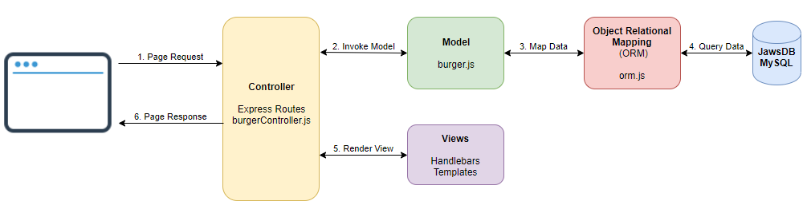

# Burger
Eat-Da-Burger
## Badges

## Description
Eat-Da-Burger! is a restaurant app that lets users input the names of burgers they'd like to eat. Whenever a user submits a burger's name, the app will display the burger on the left side of the page -- waiting to be devoured. Each burger in the waiting area also has a `Devour it!` button. When the user clicks it, the burger will move to the right side of the page.
The app will store every burger in a database, whether devoured or not.

  

## Topics
- Model-View-Controller (MVC)
- Object Relational Mapping (ORM)
- Express.js
    - HTTP Requests (GET, PUT, DELETE)
    - Routes and static content
    - Handlebars engine integration
- Node.js
- Backend API calls
- Handlebars Templates and Layouts
- MySQL

## Table of Contents
* [Description](#description)
* [Topics](#topics)
* [Installation](#installation)
* [Usage](#usage)
* [Technologies](#technologies)
* [Contributing](#contributing)
* [Test](#test)
* [Challenges](#challenges)
* [Questions](#questions)
* [License](#license)
* [Author](#Author)
* [Badges](#badges)

## Installation
Before installing this application on yopur local computer, ensure that you have Node installed. This application works in Node. You can go to the following website to download Node: <a href='https://nodejs.org/en/'>Node</a>

    1. Clone the Git repository
        $ git clone <repo>
    2. Navigate to the directory and install the dependencies
        $ npm install

## Usage
    1. Create a MySQL database and run the following files to set up the schema
        db/schema.sql
        db/seeds.sql
    2. Configure the database connection settings in config/connection.js

    3. Navigate to the repository folder and run server.js to start
        $ node server.js
    4. Navigate to localhost:3307 in the browser

    5. Add burgers to the New Burgers List, Devour them and delete once you are done enjoying the burger!

## Technologies
   - Node.js
   - MySQL
   - Node Packages (express, mysql, express-handlebars, body-parser )
   - Bootstrap

## Contributing
If you would like to contribute to this project please reach out to me on Github or email.

## Test
There are no automatic test designed for this application. I ran manual test to make sure everything was working the way it should.
    - Typed a buger into the place order field, clicked the place order button - the burger was added to the new order section of the app.
    - Clicked devour button in the new order section to remove the burger from the new order section and was placed in the previous order section of the app.
    - Click the delete button in the previous order section and the burger was deleted from the previous order and completely off the application.

If you would like to design an automatic test for this application feel free to reach me on GitHub or Email

## Challenges
There were not that many challenges that I experienced building this application. I experience path issues with some of the css files, but that was an easy fix because I was able to recognize what was getting on when I used my dev tools. I find the dev tools one of the tools that made this application build easier.

## Questions
If you have questions about this repository? Please contact me at [kamara.moses@yahoo.com](mailto:kamara.moses@yahoo.com). View more of my work in GitHub at [kamara-moses](https://github.com/kamara-moses).

## License
This repository is licensed under the MIT license.

Copyright (c) [2020] [Moses Kamara]

Permission is hereby granted, free of charge, to any person obtaining a copy of this software and associated documentation files (the 'Software'), to deal in the Software without restriction, including without limitation the rights to use, copy, modify, merge, publish, distribute, sublicense, and/or sell copies of the Software, and to permit persons to whom the Software is furnished to do so, subject to the following conditions:

The above copyright notice and this permission notice shall be included in all copies or substantial portions of the Software.

THE SOFTWARE IS PROVIDED 'AS IS', WITHOUT WARRANTY OF ANY KIND, EXPRESS OR IMPLIED, INCLUDING BUT NOT LIMITED TO THE WARRANTIES OF MERCHANTABILITY, FITNESS FOR A PARTICULAR PURPOSE AND NONINFRINGEMENT. IN NO EVENT SHALL THE AUTHORS OR COPYRIGHT HOLDERS BE LIABLE FOR ANY CLAIM, DAMAGES OR OTHER LIABILITY, WHETHER IN AN ACTION OF CONTRACT, TORT OR OTHERWISE, ARISING FROM, OUT OF OR IN CONNECTION WITH THE SOFTWARE OR THE USE OR OTHER DEALINGS IN THE SOFTWARE.

## Author

